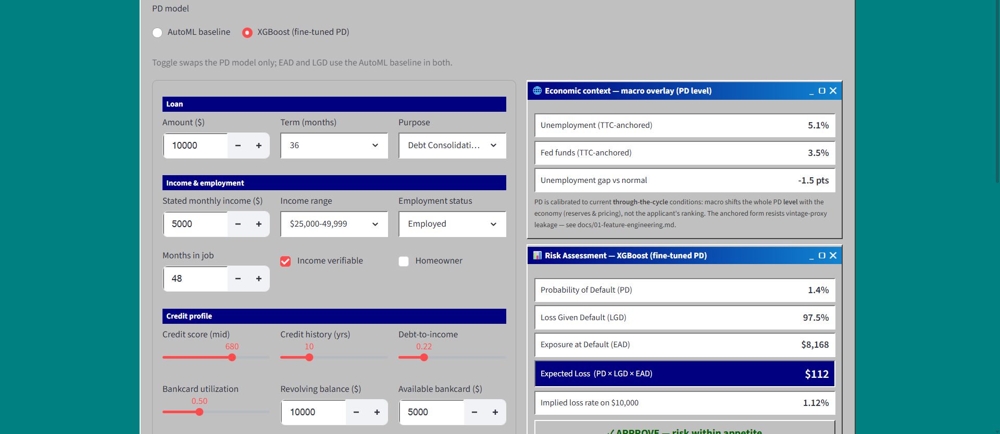
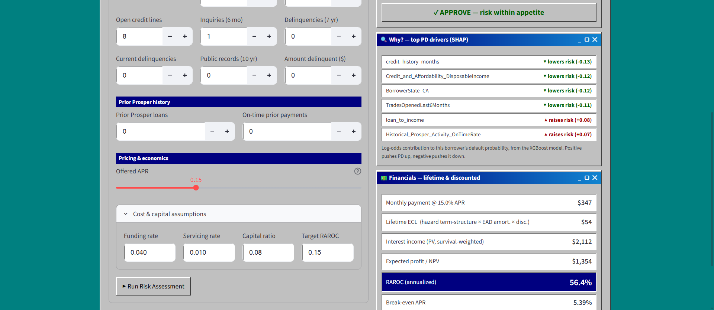
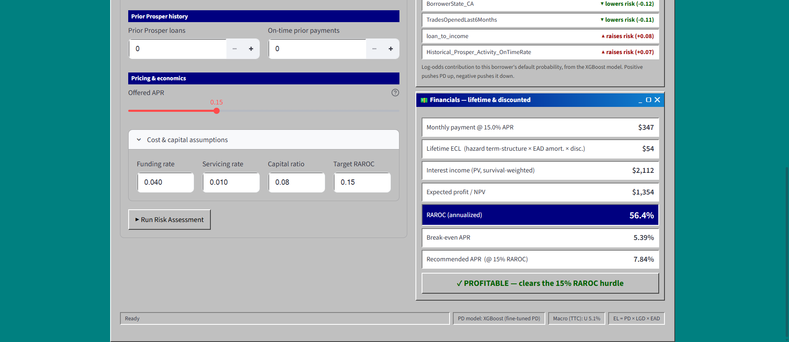

# Credit Risk Scorecard

A lender-facing credit-risk engine that estimates the **Expected Loss** of a consumer loan and
turns it into **pricing and provisioning decisions**, built on the
[Prosper Loan dataset](https://www.kaggle.com/) (~113k loans, 81 columns).

## Demo




## The financial modeling

Lending is the business of pricing risk. This project models each component of the regulatory
credit-loss identity and composes them into the figures a lender actually acts on:

```
Expected Loss (EL) = PD × LGD × EAD
```

| Component | Meaning | Why it matters | Model |
|---|---|---|---|
| **PD**  | Probability of Default        | how likely the borrower stops paying | Calibrated **XGBoost**, benchmarked vs an AutoML baseline **and** Prosper's own grade ranking |
| **LGD** | Loss Given Default (fraction) | how much is lost if they do          | Regressor vs a mean-LGD baseline |
| **EAD** | Exposure at Default ($)       | how much is owed at that point       | Regressor vs a full-exposure baseline |

`EL` is the expected loss on a single underwriting decision. Spread over the loan's life with a
**discrete-time hazard term structure**, it becomes a discounted **lifetime ECL** — the CECL / IFRS-9
provisioning quantity — which in turn drives **expected profit / RAROC** and a **risk-based APR**.
That chain — PD/LGD/EAD → EL → lifetime ECL → price — is the financial spine of the tool.

## The technical approach — building it production-grade

Accuracy is necessary but not sufficient: a model that sets reserves and prices loans has to be
*defensible*. The build is organized around the disciplines that make it so, not around chasing a
leaderboard number:

- **Honest measurement.** Every result is reported on an **out-of-time (vintage) split** — train on
  earlier originations, test on later, the credit-risk standard — never a flattering random split.
- **Calibrated probabilities, not just rankings.** PD is **isotonically calibrated** so `PD × LGD × EAD`
  is correct *in dollars*, confirmed by an **ECL backtest** against realized losses by vintage.
- **Leakage control.** The point-in-time **macro overlay** is **through-the-cycle (TTC)–anchored**, so
  it adds real economic signal without letting the model read the vintage off the unemployment level.
- **Loss timing, not just loss level.** A **discrete-time hazard model** gives each borrower a monthly
  PD **term structure** (benchmarked against scikit-survival) — the timing a discounted ECL needs.
- **Governance.** An **SR 11-7-style model card**, a per-variable data dictionary, and per-topic
  write-ups document intended use, data, metrics, limitations, and fair-lending treatment.

A local **Streamlit** app (a Windows-98 underwriting terminal) makes it tangible: enter a borrower and
see PD/LGD/EAD/EL, a per-borrower **SHAP** explanation, the current macro overlay, and full risk-based
pricing. Layer-by-layer status is in [Project status](#project-status); the full write-ups are indexed
in [`docs/`](docs/README.md).

> **Governance.** [`DATA_DICTIONARY.md`](DATA_DICTIONARY.md) is the per-variable treatment
> authority — which fields are features, benchmarks, loss-only labels, or excluded, and why.
> `features.py` is the executable feature manifest; where the two disagree, `features.py` wins.

---

## Project status

✅ **v1, v2, and v3 complete.**

| Step | Component | Status |
|------|-----------|--------|
| v1 | AutoML Baseline, 'RiskPredictor' serving interface, Finetuned PD (XGBoost + SHAP), Streamlit Frontend | ✅  |
| v2 | Financial Engine for Lender Decisions, Integration into Frontend | ✅  |
| v3 | Depth, Time-Awareness, Generalizability: Inclusion of Macroeconomic Data with TTC-Anchoring, OOT/Vintage Validation, Time Hazard Model, ECL Backtesting, Packaging  | ✅  |


**Deferred beyond v3 (future):** regional (state) unemployment overlay (pipeline built —
`build_state_features.py` — needs the data pulled), prepayment / competing-risks survival, a
two-stage LGD model, CCAR/IFRS-9 stress scenarios, and ECOA adverse-action reason codes.

---

## Repository layout

```
data/
  loader.py                Pull raw data from Kaggle (via kagglehub)
  features.py              Authoritative manifest + live data-build entrypoint: treatment, population,
                           derived + engineered features, RiskCluster, macro/state joins, PD/EAD/LGD
                           labels, and the out-of-time train/test split
  data_analysis.py         Standalone EDA toolkit (missing report, WOE/IV ranking, target-rate views)
  build_macro_features.py  Pull + TTC-smooth NATIONAL macro (FRED unemployment + fed funds)
  build_state_features.py  Pull + TTC-smooth PER-STATE unemployment (future regional overlay)
  build_loan_month_panel.py  Person-period loan-month panel for the discrete-time hazard model
  raw/                     Raw dataset + macro panels (gitignored; macro_monthly.csv tracked)
  processed/               Train/test splits (gitignored)
modeling/
  common/
    data.py                Load splits + build per-metric (X, y) with feature-set switches
    metrics.py             PD/EAD/LGD metric suites (AUC/Gini/KS/Brier, calibration)
    predictor.py           RiskPredictor — the in-process scoring API the app calls
    finetune.py            Shared FLAML tune + isotonic-calibrate + eval harness
    finance.py             Financial engine: amortization, lifetime ECL, RAROC, risk-based pricing
  probability-of-default/  PD AutoML baseline + finetune_{xgboost,lightgbm,rf,logistic}.py
  exposure-at-default/     EAD AutoML baseline
  loss-given-default/      LGD AutoML baseline
  train_baselines.py       Trains the three AutoGluon baselines (resplits from raw first)
  build_default_timing.py  Default-timing curve for the finance engine
  build_risk_clusters.py   Fits the persisted KMeans RiskCluster pipeline (train-only)
  diagnose_features.py     IV/WOE + collinearity (VIF / Spearman) feature diagnostics
  run_matrix.py            Crash-resilient cumulative v1->v4 feature-set matrix (per-cell isolation)
  run_version.py           Single-version run with IV/WOE table + explainability drivers
  run_partc.py             Out-of-time study: {random, OOT} x {raw, TTC} macro grid
  run_finalize.py          No-macro OOT baseline + matrix-cell backfills
  results_visual.py        Plots the matrix -> docs/finetuning_matrix.png
  survival/                Discrete-time hazard: loan-month panel + XGBoost hazard, PD term
                           structure (term_structure.py), scikit-survival benchmark
  ecl_backtest.py          ECL backtest: predicted-vs-realized $ loss by origination vintage
  results_charts.py        Builds the results write-up's money charts -> docs/ (committed PNGs)
  model-results/           Saved metric tables + matrices (gitignored)
app/
  app.py                   Streamlit Win98 underwriting terminal (PD/LGD/EAD/EL, toggle, SHAP, financials)
docs/
  README.md                Index of the topic write-ups (start here)
  01-feature-engineering.md       Feature selection/engineering + leakage-safe TTC macro overlay
  02-pd-model-finetuning.md       AutoML baseline, tree challengers, calibration, the AUC ceiling
  03-validation-methodology.md    Out-of-time splits + decile/by-vintage calibration
  04-discrete-time-hazard-model.md  Loan-month panel, monthly hazard, PD term structure
  05-ecl-backtesting.md           Predicted vs realized $ loss by vintage
  06-model-card.md                SR 11-7-style model card (intended use, data, metrics, limits)
  *.png                    The four committed money charts (one per relevant doc above)
models/                    Serialized artifacts (gitignored): risk_cluster.joblib,
                           feature_defaults.json, default_timing.json; pd_*.joblib live beside
                           the PD scripts, AutoGluon dirs as modeling/<metric>/automl_model/
DATA_DICTIONARY.md         Per-variable treatment authority (features / benchmarks / labels / excluded)
```

> `features.py` is the single source of truth for model inputs. Only fields knowable **at
> the underwriting decision** are used. Excluded as inputs: **outcome fields** (`LP_*`
> payments/losses, `ClosedDate`, delinquency cycles — these build EAD/LGD *labels*),
> **price fields** set by underwriting (`BorrowerRate`, `BorrowerAPR`, `LenderYield`,
> `MonthlyLoanPayment`), and **Prosper's own scores/ratings** (kept as benchmarks, not
> features). See `DATA_DICTIONARY.md` §11 for the full rule set.

---

## Getting started

### 1. Environment

```bash
python -m venv .venv
.venv\Scripts\activate          # Windows (PowerShell: .venv\Scripts\Activate.ps1)
pip install -r requirements.txt
```

### 2. Credentials

Kaggle API credentials are read from `secrets/.env` (gitignored). Provide your
Kaggle username and key there for `loader.py`.

### 3. Build the data and models

```bash
python data/loader.py            # downloads the raw dataset to data/raw/
python data/features.py          # population filter + labels -> data/processed/ splits
python modeling/train_baselines.py   # trains AutoGluon PD/EAD/LGD -> models/ + metrics
```

`train_baselines.py` uses a small AutoML budget by default for fast iteration; for a
production-grade baseline raise it (env vars; the example uses bash syntax):

```bash
AUTOML_TIME_LIMIT=600 AUTOML_PRESET=best_quality python modeling/train_baselines.py
```

To enable the fine-tuned PD toggle and the hazard-driven lifetime ECL (all optional — without the
fine-tuned model the app uses the AutoML PD, and without the hazard model it falls back to the
empirical default-timing curve):

```bash
python modeling/build_risk_clusters.py                        # RiskCluster segmentation (train-only)
python modeling/probability-of-default/finetune_xgboost.py    # fine-tuned PD (XGBoost) + SHAP
python modeling/build_default_timing.py                       # empirical default-timing fallback
python data/build_loan_month_panel.py                         # loan-month panel for the hazard model
python modeling/survival/hazard_xgboost.py                    # discrete-time hazard PD term structure
```

### 4. Run the app

```bash
streamlit run app/app.py
```

---

## Modeling notes

- **Target.** A loan is "bad" when `LoanStatus ∈ {Defaulted, Chargedoff}` → 1; `Completed`
  → 0. Unresolved loans (`Current`, `PastDue*`, `FinalPaymentInProgress`) are **dropped** —
  coding them as good would label immature vintages safe (incomplete performance window).
- **Population scope.** Post-July-2009 originations only, so feature availability is
  consistent (`ProsperScore`/`ProsperRating`/`Estimated*` are post-2009; `CreditGrade` is
  pre-2009).
- **PD metrics.** AUC, Gini (= 2·AUC−1), KS statistic, plus calibration via Brier score
  and log-loss. PD is calibrated so the Expected Loss product is meaningful. Benchmarked
  against both an AutoML model and Prosper's own grade ranking (challenger vs. champion).
- **EAD.** Installment loans have no undrawn commitment (no CCF); the label is outstanding
  principal at default, `LoanOriginalAmount − LP_CustomerPrincipalPayments`. Lazy baseline
  assumes full exposure.
- **LGD.** Label = net principal loss / EAD (`LP_NetPrincipalLoss / EAD`), clipped to
  [0, 1]; expected bimodal, so a two-stage cure/severity approach is on the table.
  PV-discounted recoveries and a Basel **downturn-LGD** view are noted refinements.
  Validated on calibration / predicted-vs-actual loss, not AUC.
- **Missing-value handling.** `features.py` fills *informative* nulls deliberately — prior-Prosper
  fields → 0 with an `is_repeat_borrower` flag, ratio denominators guarded, engineered features → a
  `-1.0` sentinel — and flags the `DebtToIncomeRatio` `10.01` cap rather than treating it as a value.
  Any remaining missing values are handled by the learners natively (AutoGluon imputes internally;
  XGBoost splits on NaN).
- **Fine-tuned PD.** XGBoost, FLAML-tuned and isotonic-calibrated, chosen after a like-for-like
  comparison with LightGBM and Random Forest (all on the same split/features). It is **best or tied
  at the shipped (v4) feature set** — test AUC **0.7612**, tied with LightGBM and edging the AutoML
  baseline (0.750) once the macro overlay is in — and best in three of the four cumulative-matrix
  steps (LightGBM edges it only at the cluster-only v2). Shipped on the base + engineered +
  RiskCluster + TTC-macro feature set (see the macro bullet below), with per-borrower SHAP for the
  "Why?" panel. EAD/LGD stay on the AutoML baseline under both toggle states.
- **Macro overlay (TTC-anchored).** Unemployment + fed funds at origination are added as a
  *through-the-cycle*–anchored feature (smoothed and shrunk toward a long-run mean), not the
  raw point-in-time level. We tested this hard: raw macro lifts AUC ~+0.015 on a random split
  but that lift is **partly a vintage proxy** — out-of-time it shrinks (XGBoost) and even turns
  *negative* for the logistic model. TTC anchoring generalizes best out-of-time (LightGBM
  ~+0.025) and rescues the logistic model from overfitting. Macro shifts the **PD level** with
  the economy (it's a cycle calibration for EL/reserves/pricing), not the applicant ranking.
  Full plain-language write-up + the random-vs-out-of-time results table:
  [docs/01-feature-engineering.md](docs/01-feature-engineering.md).
- **Recommended next overlay — regional (state) unemployment.** The national macro only varies
  by date, so on a random split it partly acts as a vintage proxy. The borrower's *own state's*
  unemployment at origination is **cross-sectional** (it differs between borrowers on the same
  day), so it's far less of a vintage artifact and has a real shot at helping out-of-time. The
  pipeline is **already built and TTC-smoothed per state** (`data/build_state_features.py`,
  `features.assign_state_features`, `macro_set='ttc_geo'`); it just needs the 51 BLS/FRED state
  series pulled (a free FRED API key) to activate. Slated for a future version.
- **Explainability & fair lending.** SHAP gives per-borrower attributions for the fine-tuned
  PD model, surfaced in the app's "Why?" panel. `BorrowerState`/`Occupation` can proxy
  protected class — handled with care and documented in the model card.

### Financial engine

The app turns PD/LGD/EAD into lender decisions via `modeling/common/finance.py`: a discounted
**lifetime ECL** (PD term-structure × amortizing EAD × discounting at the loan's rate),
**expected profit / RAROC**, and **risk-based pricing** (break-even APR and the APR that hits
a target RAROC). The offered APR is a financial *input/output*, never a model feature — which
is exactly why the price can be solved for. Loss timing comes from the discrete-time hazard term
structure (with an empirical-curve fallback); see the module's plain-English header for the
remaining assumptions (prepayment is not yet modeled).

### Platform note

Everything runs natively on **Windows** (and macOS/Linux). The AutoML baselines use
**AutoGluon** and the fine-tuned PD model uses **XGBoost** — no WSL2, Docker, or Linux-only
dependency is required.

---

## Disclaimer

This is an educational / research project on a public dataset. It is **not** a production
underwriting system and should not be used for real lending decisions.
