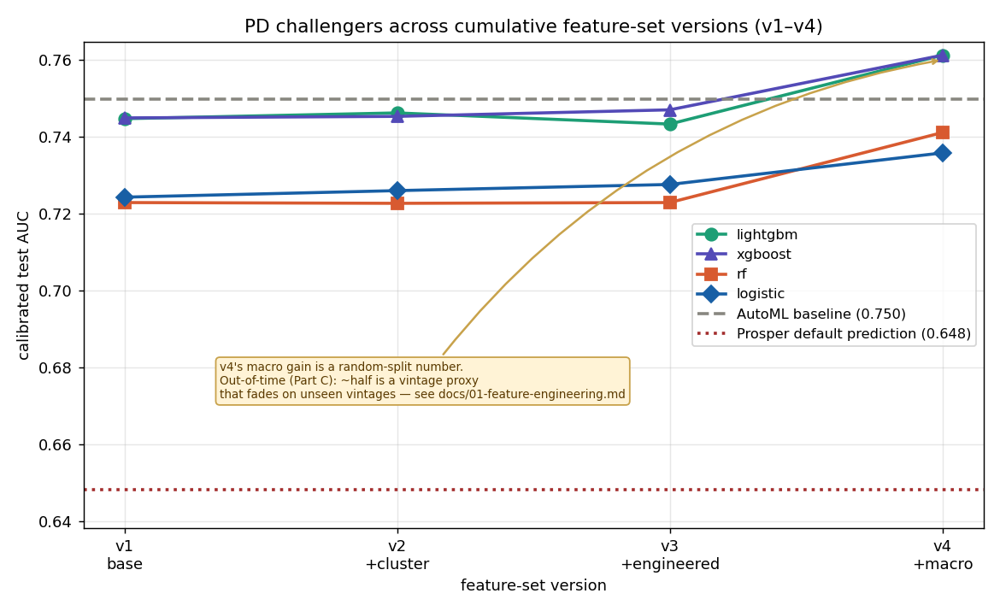

# Feature Engineering & Macro Overlay — selection, ratios, and leakage-safe macro

How the model's inputs were chosen, what was engineered on top of the raw Prosper fields, and how
the macroeconomic overlay is built so it adds real signal **without leaking the vintage**. Every
feature here is knowable at the underwriting decision; outcome and price fields are excluded as
features by `DATA_DICTIONARY.md` (the per-variable authority) and `data/features.py` (the executable
manifest).

---

## 1. Feature selection — the evidence step

Before engineering anything, candidate features were scored model-free so the work was driven by
evidence, not intuition (`modeling/diagnose_features.py`):

- **Information Value (IV)** — the credit-industry standard for single-feature predictive power
  against the binary default target, on the usual bands: `<0.02` useless · `0.02–0.1` weak ·
  `0.1–0.3` medium · `0.3–0.5` strong · `>0.5` suspicious / likely leakage. IV both *promotes* weak
  raw fields worth combining and *flags* anything implausibly strong as a leakage check.
- **Collinearity** — Spearman `|ρ| ≥ 0.8` pairs plus **VIF** on the engineered numerics, so two
  features that say the same thing don't both survive.

This pass is also what kept the set honest: `Credit_and_Affordability_LTI` was **dropped** because it
was a perfect duplicate of the base derived feature `loan_to_income` (Spearman 1.0, VIF ≈ 5.6M in the
diagnostic). The remaining engineered features each clear the IV/collinearity bar.

## 2. Engineered features — affordability, credit depth, and history

`feature_engineering()` adds metrics that the raw fields imply but don't state directly. They are
**deliberately kept out of the AutoML baseline** (`MODEL_FEATURES`) so the baseline stays
feature-engineering-free; the fine-tuned challengers opt in via `MODEL_FEATURES + ENGINEERED_FEATURES`
— that contrast is what the v1→v4 ablation (below) measures.

**Affordability & leverage** (dollars and ratios, because two borrowers at the same DTI differ
greatly if one keeps \$300/mo and the other \$3,000/mo):

| Feature | What it captures |
|---|---|
| `EstMonthlyDebtObligation` | reconstructed monthly debt service (DTI × stated income) |
| `DisposableIncome` | dollar buffer **before** the new loan |
| `ReferencePTI` | the *new* loan's payment as a share of income, priced at a fixed `REFERENCE_APR` (the real rate is an excluded price field) |
| `ResidualIncome` | VA-underwriting-style dollars left **after** existing debt *and* the new payment |
| `TotalUtilization` | revolving balance ÷ total revolving limit (clipped) |

**Credit depth & velocity** (bureau data): `OpenToTotalLineRatio` (how extended across open lines),
`InquiryVelocity` (recent credit-seeking density), `RecentDelinquencyShare` (is delinquency recent or
historical).

**Historical Prosper activity** (prior-loan behaviour, leakage-guarded): `OnTimeRate`,
`OutstandingDebtRatio`.

**New-information flags** (not transforms of existing features): `IncomeBand_Mismatch` (stated income
inconsistent with the self-reported band) and `Income_Undefined` (the zero/undefined-income
sentinel). Ratios that divide by a possibly-zero column are made finite and missing values filled
with a `-1.0` sentinel so trees can split on "undefined" explicitly.

## 3. RiskCluster — unsupervised borrower segmentation

`RiskCluster` is a single categorical feature: a **KMeans** segment label fit on a median-impute →
`StandardScaler` → KMeans pipeline over `CLUSTER_FEATURES` (`k` searched over 3–7), **fit on train
only** and one-hot encoded. Scaling matters because the inputs mix dollars and ratios. It gives the
model a coarse "kind of borrower" handle that, empirically, carries most of what the hand-built
ratios were reaching for.

## 4. Did the engineering help? The v1→v4 ablation

Every feature decision is judged on the **out-of-time (vintage) test set** (see
[`03-validation-methodology.md`](03-validation-methodology.md)), accumulated in a cumulative matrix
(`modeling/run_version.py` → `version_matrix.csv`, plotted in `finetuning_matrix.png`). XGBoost
calibrated test AUC across the build:

| Version | Features | Test AUC | Δ |
|---|---|---|---|
| v1 base | 49 | 0.7449 | — |
| v2 + RiskCluster | 50 | 0.7453 | +0.0004 |
| v3 + engineered ratios | 62 | 0.7470 | +0.0017 |
| v4 + **TTC macro** | 65 | **0.7612** | **+0.0142** |

The honest finding: **the engineered ratios and clustering are largely redundant** once the trees
have the base fields — they move out-of-time AUC only ~0.002. The real lift comes from the **macro
overlay** (+0.014), and only in its leakage-safe form. The ~0.745–0.750 pre-macro ceiling is
**information-bound**, not model-bound (see [`02-pd-model-finetuning.md`](02-pd-model-finetuning.md)).
The redundant features are kept as documented due-diligence, not discarded silently.

---

## 5. The macro overlay — and why it's *through-the-cycle (TTC)–anchored*

**Decision (2026-06):** when the PD model uses the economy as a feature, it uses the **TTC-anchored**
form of unemployment and the fed funds rate — not the raw point-in-time level. The economy at
origination is known when you underwrite, so it is a *fair, leakage-safe* feature; the question was
only **does adding it help, and in what form?** Three candidate forms exist (all built by
`data/build_macro_features.py`): **raw** (the actual level that month, spiky), **TTC-anchored**
(smoothed and pulled toward its long-run average), and **robust** (cyclical gap + trailing
year-over-year change).

### 5.1 The first answer looked great — and was misleading

On a **random split** (shuffle all loans 2009–2014, train 80% / test 20%), adding **raw** macro
lifted AUC ~**+0.015** for the tree models and pushed the best model to ~0.76, beating the AutoML
baseline (0.750). But there's a trap: unemployment was high in 2009–2011 (~9–10%) and lower by
2013–2014 (~6–7%), so **the unemployment number doubles as a date-stamp for when the loan was made.**
The early loans defaulted more (worse economy *and* looser early underwriting). On a random split the
model sees some 2010 loans in both train and test, so it learns "loans stamped ~9.5% unemployment go
bad" — **memorizing which vintages were bad and reading the vintage off the macro value**, not
learning a general economic effect. That number looks powerful in a backtest but wouldn't help on a
real future applicant.

### 5.2 The honest test: out-of-time, with a fair baseline

To catch that, an **out-of-time (OOT) split** trains on the **old** loans (pre-2013) and tests on the
**newer** ones (2013–2014) — the way a model is actually used. Every model was run two ways (random
vs OOT) × two macro forms (raw vs TTC), with a **no-macro base model** as the reference so macro's
*isolated* contribution could be measured (the OOT set is also just a harder cohort — 12.5% bad vs
~25% — and we didn't want to credit macro for that). Macro's isolated lift (macro − base, same split;
`run_partc.py` → `partc_matrix.csv`):

| Model | lift on RANDOM | lift OOT (raw) | lift OOT (**TTC**) |
|---|---|---|---|
| XGBoost | +0.015 | +0.008 | +0.007 |
| LightGBM | +0.014 | **+0.017** | **+0.025** |
| Random Forest | +0.014 | +0.003 | +0.001 |
| Logistic | −0.001 | **−0.024** | +0.000 |

Three things fall out:

1. **Macro is *partly* real, not pure date-stamp.** Out-of-time it still adds ~+0.008 (XGBoost) to
   ~+0.017 (LightGBM) — the economy genuinely carries default signal. But for XGBoost the random-split
   +0.015 was about **half** inflation; only half survived.
2. **Raw macro can actively hurt.** For the logistic model raw macro is **−0.024** out-of-time: it
   overfits the exact levels it trained on and mis-fires on the new period.
3. **TTC anchoring fixes both.** It rescues the logistic model (−0.024 → ~0) and improves LightGBM
   (+0.017 → **+0.025**). Smoothing the spikes and shrinking toward the long-run average makes the
   model lean on the cycle's *shape* rather than one era's exact numbers — which is what generalizes.
   (On a random split TTC looks identical to raw for trees, which only care about value *order*;
   its benefit shows up **only** out-of-time. That's the point: it buys robustness, not a higher
   backtest score.)

### 5.3 The decision, and a subtlety worth stating

**Use TTC-anchored macro.** It delivers a real, OOT-validated lift for the gradient-boosted models
(LightGBM ~+0.025, XGBoost ~+0.007) and protects the interpretable model from the vintage-overfit raw
macro causes. The deployable benefit is **smaller than the +0.015 random-split headline but genuinely
positive and downturn-robust** — the right trade for a credit model that must survive a changing
economy. Raw macro is kept (`MACRO_FEATURES_RAW`) only to reproduce the experiments.

A subtlety: for a batch of applicants scored on the **same day**, macro is *identical* for all of
them, so it does **not** change their *ranking* — it shifts the **whole PD level** up or down with the
economy. That doesn't matter for "who is riskier than whom," but it matters a lot for the **dollar
outputs** (expected loss, lifetime ECL, reserves, risk-based pricing), which should rise in a downturn
and ease in a recovery. So macro lives in the model as a **through-the-cycle calibration of the PD
level** — exactly where a credit-risk practitioner wants it.

## 6. How it's wired / reproduce

- `data/features.py` — `MACRO_FEATURES = MACRO_FEATURES_TTC` makes TTC canonical; `current_macro()`
  returns the latest month's TTC values for scoring a brand-new loan.
- `modeling/common/data.py` — `macro_set='ttc'` (default when macro is on) selects the TTC columns.
- `modeling/common/finetune.py` / `predictor.py` — challengers train on base + engineered + cluster +
  TTC macro; at scoring the latest TTC macro is attached to the applicant row.
- **Reproduce:** `modeling/diagnose_features.py` (IV + collinearity), `modeling/build_risk_clusters.py`
  (RiskCluster), `modeling/run_version.py` (v1–v4 matrix), `modeling/run_partc.py` (random-vs-OOT ×
  raw-vs-TTC grid), `modeling/run_finalize.py` (no-macro OOT baseline). See also
  [`02-pd-model-finetuning.md`](02-pd-model-finetuning.md) and the model card
  ([`06-model-card.md`](06-model-card.md)).
