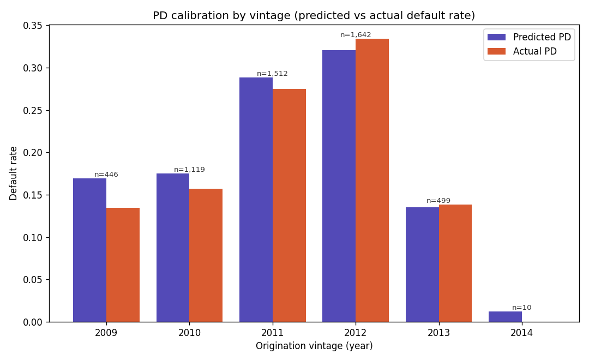

# Validation Methodology — out-of-time splits, calibration, and vintage checks

How model quality is *measured* here, and the choices that sharpen those measurements from a single
headline AUC into numbers a credit-risk validator would accept: an **out-of-time** test instead of a
random one, **calibration** so probabilities mean what they say, and a **by-vintage** read so the
calibration is shown to hold across cohorts rather than only on average.

---

## 1. The split: out-of-time, not random

Every metric in this project is computed on an **out-of-time (vintage) split** —
train on originations **before** `data.OOT_CUTOFF = 2013-01-01`, test on **2013 onward** — not on a
random shuffle. This is the credit-risk standard because it mirrors how the model is actually used:
built today on the loans you have, applied to applicants from a period you haven't seen.

The difference is not cosmetic (`run_partc.py` → `partc_matrix.csv`): the same XGBoost lands at
**~0.76 AUC on a random split but ~0.72 out-of-time**. The random number is optimistic because the
model gets to see neighbouring loans from the same vintage in both train and test; the OOT number is
the honest one. The OOT test cohort is also simply *harder and different* (≈12.5% default rate vs
~25% in the earlier book), which is exactly why feature contributions are always measured **against a
no-macro base model on the same split** rather than read off a raw AUC jump (see
[`01-feature-engineering.md`](01-feature-engineering.md)).

## 2. Discrimination vs. calibration — two different questions

A model can rank well yet still quote the wrong probability. We track both, because the ECL engine
needs the actual number, not just the order:

- **Discrimination — can it tell good from bad?** AUC / Gini / KS. The shipped calibrated XGBoost:
  **AUC 0.7612**, Gini 0.522, KS 0.379.
- **Calibration / sharpness — is the quoted PD *correct in level*?** Brier score and LogLoss. These
  are what **isotonic recalibration** improves: it costs ~0.002 AUC but cuts XGBoost's Brier from
  0.186 to **0.154** and LogLoss from 0.546 to **0.471** (see
  [`02-pd-model-finetuning.md`](02-pd-model-finetuning.md)). A well-ranked-but-miscalibrated model
  would silently bias every `PD × LGD × EAD` dollar figure.

## 3. Calibration by decile — does predicted ≈ actual?

Sorting the test set into ten predicted-PD buckets and comparing predicted vs realized default rate
(`calibration_decile.csv`) gives the sharpest single calibration read. Predicted tracks actual across
the whole range — from the safest decile (pred 0.021 vs actual 0.027) to the riskiest (pred 0.615 vs
actual 0.624) — with a **count-weighted mean |predicted − actual| ≈ 0.017**. The probabilities are
trustworthy in level, not just in order.

## 4. Calibration by vintage — does it hold across cohorts?



The decile view averages over time; the **by-vintage** view (`calibration_vintage.csv`) is the
stress test, checking that predicted ≈ actual *within each origination year* rather than only in
aggregate. It does, on the vintages with enough loans to read: 2009 (n≈446, gap +0.035) through 2012
(n≈1.6k, gap −0.013). The latest vintage (2014, n≈10) is too thin to interpret and is shown only for
completeness. This is the difference between "well-calibrated on a backtest" and "well-calibrated the
way a regulator asks" — across cohorts, including the out-of-time ones.

## 5. Why this is the load-bearing methodology

The OOT discipline is not just a PD-scoring choice; it is the lens **every** downstream decision is
judged through — the feature ablation ([`01-feature-engineering.md`](01-feature-engineering.md)), the
hazard model's survival metrics ([`04-discrete-time-hazard-model.md`](04-discrete-time-hazard-model.md)),
and the dollar backtest ([`05-ecl-backtesting.md`](05-ecl-backtesting.md)) are all reported
out-of-time. It is what lets the project claim a *defensible* model rather than a flattering one.

## 6. Reproduce

```
.venv\Scripts\python.exe modeling\calibration_report.py   # decile + vintage calibration tables
.venv\Scripts\python.exe modeling\run_partc.py            # random-vs-OOT discrimination grid
.venv\Scripts\python.exe modeling\results_charts.py       # -> docs/calibration_by_vintage.png
```

See the model card ([`06-model-card.md`](06-model-card.md)) for how these metrics roll up into the
governance summary.
