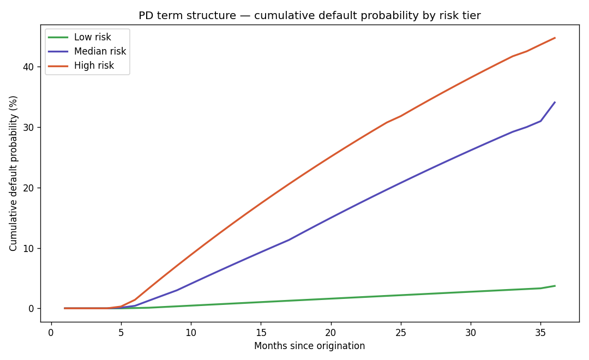

# Discrete-Time Hazard Model — monthly default timing for lifetime ECL

A single lifetime PD tells you *whether* a loan defaults, not *when*. A discounted lifetime ECL needs
the *when*. This is the model that supplies it: a covariate-driven **monthly hazard** `h(t | x)` — the
chance a loan defaults in month *t* given it survived to *t* and given the borrower *x* — from which
a per-loan **PD term structure** is compounded.

---

## 1. Why a hazard model

The original finance engine took one lifetime PD and smeared it across the loan's months with a
**fixed empirical curve** — the same shape for every borrower. That's a placeholder: a thin-file and a
thick-file borrower should differ in the *shape* of their risk over time, not just its level, and
early-life vs late-life default risk is the entire point of a term structure. A hazard that depends on
**both the borrower and the month** delivers that, and it slots straight into the existing
out-of-time discipline (train on older vintages, test on newer).

It also **recovers the `Current` loans** the cross-sectional PD model had to drop. Those loans hadn't
resolved, so they can't be labelled good/bad — but in a survival framing they enter honestly as
**censored** (still-alive) observations, restoring tens of thousands of loans of information instead
of discarding them.

## 2. The loan-month panel

Each loan is reshaped into **one row per month it was alive** ("person-period" format): a loan that
ran 14 months becomes 14 rows, `t = 1..14`. The target is `defaulted_this_month` — `1` only in the
month of default, `0` otherwise; rows after the event don't exist. Status maps to event/censoring as:

| LoanStatus | Treatment |
|---|---|
| `Defaulted` / `Chargedoff` | **event** (1) in the default month |
| `Completed` / `FinalPaymentInProgress` | survived → censored at payoff |
| `Current` | **censored** at months-observed (the recovered loans) |
| `Past Due (*)` | censored at last observed month (conservative; `>120 days`-as-event tested as a sensitivity) |

The single biggest correctness risk is the **observed duration** `T_obs`: for closed loans it is the
whole months between `LoanOriginationDate` and `ClosedDate` (the *true* lifetime — **not**
`LoanMonthsSinceOrigination`, which is measured to the data snapshot and can overshoot); for `Current`
loans it is months-to-snapshot (the censoring time). The build is sanity-checked before any modeling.

## 3. The model and the term structure

The estimator is the **same calibrated XGBoost classifier**, fit on the panel with the month index `t`
(plus a smooth encoding so the hazard can bend) added to the origination-time covariates. Its
predicted probability for a `(loan, month)` row *is* the discrete-time hazard. Severe class imbalance
(most loan-months are non-events) is handled with `scale_pos_weight` and survivor down-sampling with
case weights; the result is **isotonically recalibrated** on an un-sampled slice and **SHAP**-explained
exactly like the production PD model, so it reuses the whole explainability stack.

From the hazard, survival compounds month by month:

```
S(0) = 1
S(t) = S(t-1) · (1 − h(t | x))        # survive to end of month t
marginal_PD(t) = S(t-1) · h(t | x)    # default *in* month t
lifetime_PD   = 1 − S(T) = Σ marginal_PD(t)
```

`marginal_PD(t)` over `t = 1..T` **is the term structure** the ECL engine consumes
(`modeling/survival/term_structure.py`), replacing the fixed empirical curve with a borrower-specific,
model-driven timing.



The curves are representative borrowers at the 10th/50th/90th predicted-PD percentiles: risk separates
cleanly and the cumulative default probability rises **steeply early then flattens**, matching how
consumer defaults concentrate in the first two years — which is exactly the timing that drives the
discounted lifetime ECL.

## 4. Benchmark — scikit-survival

To be able to say "we evaluated the alternative," a continuous-time `RandomSurvivalForest` benchmark
is stood up and scored on a monthly grid with model-agnostic survival metrics
(`hazard_survival_metrics.csv`):

| Model | IPCW concordance | Time-dependent AUC | Integrated Brier |
|---|---|---|---|
| RandomSurvivalForest | **0.6996** | 0.7069 | 0.00275 |
| Discrete-time hazard XGBoost | 0.6637 | — | — |

The RSF discriminates a little better on rank, but the **discrete-time XGBoost ships as production**: it
produces the monthly-granularity hazard the ECL actually needs, and it reuses our calibration and SHAP
machinery. That trade — a few points of concordance for monthly-ECL fit and a unified explainability
story — is a deliberate, documented choice, with the RSF retained as the benchmark + metrics layer.

## 5. Reproduce

```
.venv\Scripts\python.exe data\build_loan_month_panel.py        # the person-period panel
.venv\Scripts\python.exe modeling\survival\hazard_xgboost.py   # fit + calibrate the hazard
.venv\Scripts\python.exe modeling\survival\benchmark_sksurv.py # RSF benchmark + survival metrics
.venv\Scripts\python.exe modeling\results_charts.py            # -> docs/pd_term_structure.png
```

The term structure feeds the dollar validation in [`05-ecl-backtesting.md`](05-ecl-backtesting.md);
see the model card ([`06-model-card.md`](06-model-card.md)) for governance.
