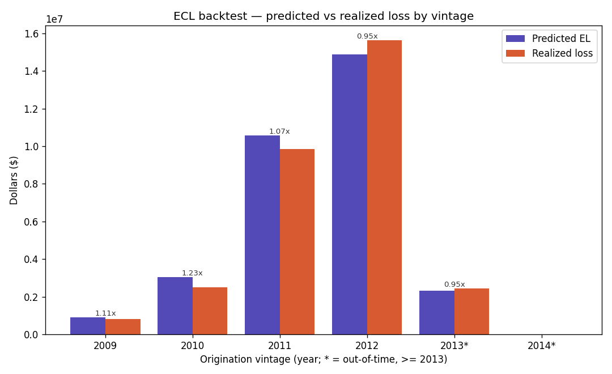

# ECL Backtesting — predicted vs realized dollar losses by vintage

The credibility centrepiece. Probability metrics show the model *ranks and calibrates* well; this
shows the whole engine — PD × LGD × EAD — lands the **dollars**. For the resolved post-2009 book, the
predicted lifetime expected loss is summed by origination vintage and compared against the **realized**
dollar losses Prosper actually booked.

---

## 1. What is computed

For every loan in the resolved book, predicted **expected loss** is the production identity, undiscounted:

```
EL = PD × LGD × EAD
```

— the same calibrated PD model, LGD/EAD regressors, and clip conventions the live engine uses
(`modeling/ecl_backtest.py` reproduces `RiskPredictor.assess()` exactly). Realized loss is Prosper's
`LP_NetPrincipalLoss` (floored at zero). Both are aggregated by **origination vintage** so the
comparison is like-for-like across cohorts, and a predicted/realized **ratio** is reported per vintage
and overall.

The backtest is deliberately **undiscounted**: it compares nominal predicted EL against nominal
realized loss, so it validates the *magnitude* of the loss engine. The hazard term structure
([`04-discrete-time-hazard-model.md`](04-discrete-time-hazard-model.md)) governs the *timing* used by
the discounted ECL for pricing — but the undiscounted lifetime total is timing-independent, which is
why it's the right quantity for a dollar magnitude check.

## 2. The result



Overall the engine predicts ≈ **\$31.7M** against ≈ **\$31.2M** realized — a **1.02**
predicted/realized ratio, i.e. calibrated to within ~2% **in dollars** over the resolved book
(`ecl_backtest_by_vintage.csv`):

| Vintage | Loans | Defaults | Predicted EL | Realized loss | Ratio |
|--------:|------:|---------:|-------------:|--------------:|------:|
| 2009 | 2,034 | 308 | \$0.89M | \$0.80M | 1.11 |
| 2010 | 5,625 | 937 | \$3.06M | \$2.49M | 1.23 |
| 2011 | 7,633 | 2,145 | \$10.56M | \$9.85M | 1.07 |
| 2012 | 8,140 | 2,622 | \$14.89M | \$15.64M | 0.95 |
| 2013\* | 2,635 | 338 | \$2.31M | \$2.44M | 0.95 |
| 2014\* | 69 | 0 | \$0.005M | \$0.00M | — |
| **ALL** | **26,136** | **6,350** | **\$31.71M** | **\$31.22M** | **1.02** |

\* out-of-time (origination ≥ 2013).

## 3. How to read it honestly

- **The aggregate is strong but composed of offsetting vintages.** Early vintages run hot (2009 1.11,
  2010 1.23) while 2012–2013 run slightly conservative (0.95); these wash out to the 1.02 headline.
  That's normal — what matters is that no vintage is wildly off and the book-level number is within
  ~2%.
- **The out-of-time dollar read is directional, not load-bearing.** Only 2013 (n=2,635) and 2014
  (n=69, zero realized loss) are out-of-sample, so the OOT *dollar* evidence is thin; the table
  surfaces this honestly via `n` and the undefined 2014 ratio rather than hiding it. The
  **2009–2012 in-sample vintages carry the calibration weight.**
- **The default count reconciles.** `n_default` sums to **6,350**, matching the event count from the
  hazard panel — confirming the resolved population is consistent across the PD, hazard, and ECL
  stages.

## 4. Reproduce

```
.venv\Scripts\python.exe modeling\ecl_backtest.py       # predicted-vs-realized $ table + chart
.venv\Scripts\python.exe modeling\results_charts.py     # -> docs/ecl_backtest.png (committed copy)
```

`ecl_backtest.py` writes `modeling/model-results/ecl_backtest_by_vintage.csv`. See the model card
([`06-model-card.md`](06-model-card.md)) for the undiscounted-backtest assumption and the
thin-vintage limitation in context.
